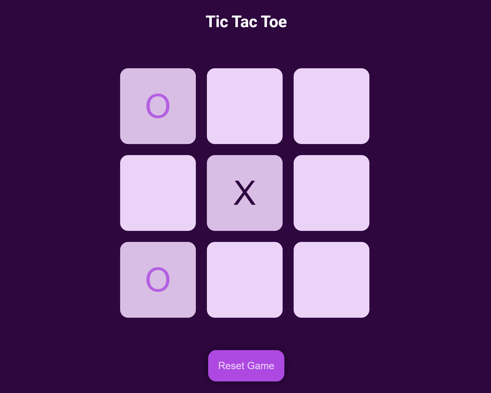

# Tic Tac Toe Game

**🎮Play for free: https://tic-tac-toe.pages.dev/**

A simple, interactive Tic Tac Toe game built with JavaScript, HTML, and CSS.

Preview:

This project demonstrates fundamental JavaScript DOM manipulation techniques. Players can take turns marking the board with "O" or "X" and the game determines the winner or if it's a draw.

## ⭐ Features

- **Player turns:** Players alternate between placing "O" and "X" on the board.
- **Win detection:** The game checks for winning combinations (horizontal, vertical, or diagonal rows).
- **Draw detection:** If the board is filled and no player has won, the game ends in a draw.
- **Reset functionality:** Players can reset the game to start a new round.

## 💻 Technologies used:

- **HTML:** Structure of the game board and UI elements.
- **CSS:** Styling and layout of the game.
- **JavaScript:** Game logic, event handling, and DOM manipulation.
